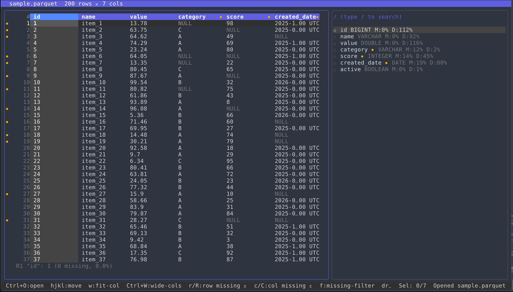

# parqview

Keyboard-first terminal UI for exploring Parquet and CSV files with DuckDB-backed preview and profiling.

## Why This Exists

`parqview` is for fast inspection of data as it moves through a pipeline.

Use it to quickly catch:

- pipeline failures that produce unexpected null-heavy outputs,
- join failures (duplicate columns, mismatched keys, broken join coverage),
- `NaN`/missing value spikes in critical features,
- out-of-distribution feature values before they break downstream models or checks.

The goal is smooth, low-friction, interactive data browsing with familiar and intuitive keyboard navigation.

## Screenshot



## Installation

### Homebrew (recommended)

```bash
brew install robince/tap/parqview
```

### Direct download from GitHub Releases

Download the archive for your platform from
`https://github.com/robince/parqview/releases`.

macOS arm64 example:

```bash
VERSION="1.0.0"
curl -fL -o parqview.tar.gz "https://github.com/robince/parqview/releases/download/v${VERSION}/parqview_${VERSION}_darwin_arm64.tar.gz"
tar -xzf parqview.tar.gz
./parqview --version
```

Linux amd64 example:

```bash
VERSION="1.0.0"
curl -fL -o parqview.tar.gz "https://github.com/robince/parqview/releases/download/v${VERSION}/parqview_${VERSION}_linux_amd64.tar.gz"
tar -xzf parqview.tar.gz
./parqview --version
```

Note for direct macOS downloads: if Gatekeeper blocks first run, remove quarantine:

```bash
xattr -dr com.apple.quarantine ./parqview
```

## Run

Open a file directly:

```bash
parqview <file.parquet|file.csv>
```

Or run from source:

```bash
go run ./cmd/parqview <file.parquet|file.csv>
```

If the app starts without a file, press `Ctrl+O` to open the file picker.

## Screens and Keys

Shortcuts below describe app-specific behavior. When a search input is focused, normal text editing keys are handled by Bubble `textinput`.

### Main Workspace (Table + Columns)

This is the default screen with a data table on the left and columns list on the right.

| Key | Action |
| --- | --- |
| `Tab` | Switch focus between table and columns panes |
| `Ctrl+O` | Open/close file picker (`.parquet`/`.csv`) |
| `q`, `Ctrl+C` | Quit |
| `Ctrl+L` | Redraw screen |
| `?` | Open/close help overlay |
| `s`, `S` | Toggle selected-columns view in data table |
| `v`, `V` | Toggle selected-columns view in columns pane |
| `Enter` | Open detail panel for active column |
| `Space` | Page down in focused pane |

### Columns Pane

Use this pane to search, triage, and build a selection set of columns.

| Key | Action |
| --- | --- |
| `/` | Focus column search input |
| `Up`, `k` | Move cursor up 1 row |
| `Down`, `j` | Move cursor down 1 row |
| `Space`, `Ctrl+F` | Page down |
| `Ctrl+B` | Page up |
| `Ctrl+D` | Half-page down |
| `Ctrl+U` | Half-page up |
| `g`, `Home` | Jump to top of full list |
| `G`, `End` | Jump to bottom of full list |
| `H` | Jump to top of current visible list window |
| `M` | Jump to middle of current visible list window |
| `L` | Jump to bottom of current visible list window |
| `x` | Toggle selection on active (crosshair) column |
| `a` | Add all filtered columns to selection |
| `d` | Remove all filtered columns from selection |
| `A` | Select all columns |
| `X` | Clear all selected columns |
| `y` | Copy selected columns as a Python list |
| `Enter` | Open detail panel for active column |

### Table Pane

Use this pane to inspect row values, navigate missingness, and check distribution shifts.

| Key | Action |
| --- | --- |
| `Up`, `k` | Move row cursor up |
| `Down`, `j` | Move row cursor down |
| `Left`, `h` | Move selected column left |
| `Right`, `l` | Move selected column right |
| `0` | Jump to first visible table column |
| `$` | Jump to last visible table column |
| `[` | Page table columns left |
| `]` | Page table columns right |
| `w` | Toggle fit-width for active column |
| `Ctrl+W` | Toggle global wide-columns mode |
| `g` | Jump to top row |
| `G` | Jump to bottom row |
| `Space`, `Ctrl+F` | Page down |
| `Ctrl+B` | Page up |
| `Ctrl+D` | Half-page down |
| `Ctrl+U` | Half-page up |
| `r` | Jump to next missing value in current row |
| `R` | Jump to previous missing value in current row |
| `c` | Jump to next row with missing value in selected column |
| `C` | Jump to previous row with missing value in selected column |
| `f` | Toggle missing-row filter |
| `Enter` | Open detail panel for selected column |

### Column Search Input (in Columns Pane)

| Key | Action |
| --- | --- |
| `Esc` | Clear query and exit search |
| `Enter` | Commit query and exit search |
| `Ctrl+U` | Clear search query |
| Text editing keys | Edit search query |

### Detail Panel Overlay

| Key | Action |
| --- | --- |
| `t` | Cycle tabs (Top Values, Stats, Histogram) |
| `n` | Jump to first missing value for detail column |
| `Esc`, `q` | Close detail panel |

### File Picker Overlay

| Key | Action |
| --- | --- |
| `Enter` | Open selected file/folder |
| `Backspace` | Go to parent folder (when query is empty) |
| `Ctrl+U` | Clear picker query |
| `Esc` | Close file picker |

### Help Overlay

| Key | Action |
| --- | --- |
| `Esc`, `?`, `q` | Close help |

### Mouse

| Action | Behavior |
| --- | --- |
| Mouse wheel | Scroll cursor in focused pane |
| Left-drag divider | Resize table/columns split |

## Technical Details: Missing Definition

By default, parqview treats both `NULL` and `NaN` as missing values for:

- missing indicators (orange dots/marker styles),
- missing-row filter (`f`),
- missing navigation (`n`, `r`/`R`, `c`/`C`),
- missing counts in profiling and footers.

This behavior is controlled by [`internal/missing/policy.go`](internal/missing/policy.go):

- `IncludeNaNAsMissing = true` (default): `NULL` + `NaN`
- `IncludeNaNAsMissing = false`: `NULL` only
